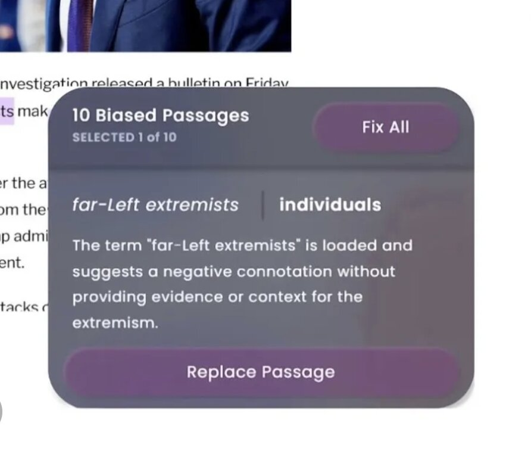

# 🧠 Biasly – AI-Powered Bias Detection for Online Articles

**Biasly** is a Chrome extension that helps users uncover and neutralize biased language in online articles.  
Think **Grammarly**, but for **political and ideological bias**.  

Using OpenAI’s ChatGPT, Biasly analyzes the content you read, highlights biased phrases, explains why they may be problematic, and suggests neutral alternatives—fostering a more informed and objective browsing experience.

---

## 📌 Features

- 🔍 **Bias Detection:** Analyzes articles for politically or ideologically biased language using AI.
- ✨ **Inline Highlighting:** Highlights biased segments directly in the article for easy visibility.
- 💬 **Explanations & Revisions:** Offers explanations for each biased phrase and suggests neutral rewrites.
- 🖱️ **Interactive Corrections:** Click on highlights to toggle between biased and neutral versions.
- 🧭 **One-Click Fix:** Replace all biased language in the article with neutral versions using the floating control panel.
- ⭐ **Rate & Recommend:** _(Coming soon!)_ Rate article bias levels and receive suggestions for more balanced reads.

---

## 🧰 Built With

- **Languages:** HTML, CSS, JavaScript (ES6)
- **Platforms:** Google Chrome Extension API
- **APIs:** [OpenAI ChatGPT API](https://platform.openai.com/)
- **Technologies:**
  - DOM Traversal & Manipulation
  - Fetch API for server calls
  - Vanilla JavaScript for all interactivity

---

## 🚀 Getting Started

### 1. Clone the Repository
git clone https://github.com/your-username/biasly.git
cd biasly

### 2. Add your API key
"Authorization": "Bearer YOUR_API_KEY_HERE"

### 3. Load the Extension in Chrome

1. Open Chrome and go to [`chrome://extensions/`](chrome://extensions/)
2. Enable **Developer mode** in the top right corner
3. Click **Load unpacked**
4. Select the folder where you cloned this repository
5. Open any article or blog post — **Biasly** will automatically analyze it!
